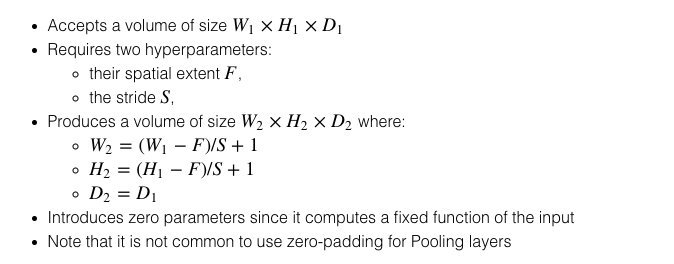

## ML Notes

#### Bias and Variance

##### Bias

bias of an estimator β^ is the difference between its expected value E[β^] and the true value of a parameter β being estimated.
More concretely, we compute the prediction bias as the difference between the expected prediction accuracy of our model and the true prediction accuracy.

##### Variance

The variance is simply the statistical variance of the estimator β^ and its expected value E[β^]

The variance is a measure of the variability of our model’s predictions if we repeat the learning process multiple times with small fluctuations in the training set.
#### Regularization

* L2 regularization or Ridge Regression cannot zero out coefficients.
* L1 regularization or Lasso Regression can zero out coefficients(good for sparse data).
* Elastic Net = Best of both worlds. (`lambda * ((j * L1)+((1-j)*L2)`)

#### Class Imbalance

* Get more data
* Generate synthetic data
* Undersampling/Oversampling
* Regularization

#### Classifier Types

Generative classifiers learn a model of the joint probability, p(x, y), of the inputs x and the label y, and make their predictions by using Bayes rules to calculate p(ylx), and then picking the most likely label y. Discriminative classifiers model the posterior p(ylx) directly, or learn a direct map from inputs x to the class labels.

#### Type I and II errors

* Type I error is false positive
* Type II error is false negative

#### Naive Bayes

What it essentially does it find the posterior probability given the prior. Called **Naive** because it assumes that X|Y is normally distributed with zero covariance.

#### Performance Metrics

* Accuracy sucks as a metric. [Misleading](https://en.wikipedia.org/wiki/Accuracy_paradox).
* Better to use Precision, Recall and ROC curves.
	* Precision : `TruePositives/TruePositives+FalsePositives`
	* Specificity: `TrueNegatives/TrueNegatives+FalsePositives`
	* Recall : `TruePositives/TruePositives+FalseNegatives`    = Sensitivity
Precision is the number of positive predictions divided by the total number of positive class values predicted. Recall is the number of positive predictions divided by the number of positive class values in the test data.
* ROC curves: Plot sensitivity vs 1-specificity. ROC stands for Receiver Operating Characteristic.
* F1 Score is `2*((precision*recall)/(precision+recall))`. Tells the balance between precision and recall.

#### Ensemble Techniques (Needs more work)
* Bagging : _Bootstrap AGGregatING_ uses a variation of data samples to train different base classifiers. Used with unstable classifiers which are sensitive to variations in training set(eg Decision Trees, Perceptrons). Used for reducing variance.
* Boosting : Used to convert weak learners to strong ones. Attaches weights proportionate to the amount of misclassification. Primarily used to reduce bias.
* Stacking : Uses an ensemble to extract features which are then again fed into an ensemble.

#### Evaluating ML Models

##### Accuracy

`print((TP + TN) / float(TP + TN + FP + FN))`

##### Sensitivity

When the actual value is positive, how often is the prediction correct? Also known as "True Positive Rate" or "Recall"
`sensitivity = TP / float(FN + TP)`

##### Specificity

When the actual value is negative, how often is the prediction correct?
`specificity = TN / (TN + FP)`

##### False Positive Rate

When the actual value is negative, how often is the prediction incorrect?
`false_positive_rate = FP / float(TN + FP)`

##### Precision

When a positive value is predicted, how often is the prediction correct?
`precision = TP / float(TP + FP)`

##### What should we use?

* Identify if FP or FN is more important to reduce
* Eg : Spam filter: optimize for precision or specificity
* Fraud Detector: optimize for sensitivity

When to use **ROC**

* insensitive to changes in class distribution (ROC curve does not
change if the proportion of positive and negative instances in the test
set are varied) 
* can identify optimal classification thresholds for tasks with differential
misclassification costs 

When to use ** PR **

* show the fraction of predictions that are false positives
* well suited for tasks with lots of negative instances


##### ROC Curver(Receiver Operating Curve)

Plots **sensitivity** vs **False Positive Rate**. The probabilistic interpretation of ROC-AUC score is that if you randomly choose a positive case and a negative case, the probability that the positive case outranks the negative case according to the classifier is given by the AUC

##### AUC

The percentage of the ROC plot that is underneath the curve. AUC is useful as a single number summary of classifier performance

Higher value = better classifier

AUC is useful even when there is high class imbalance (unlike classification accuracy)

#### Improving training/test

* Random resampling
* Stratified resampling
* Cross Validation

## Deep Learning Notes

### CNNs

* zero padding `= (k-1)/2` where k is filter size
* output size `= (w-k+2P)/2 +1` where w is input size, p is padding and s is stride
* No. of FLOPS : input depth x output depth x o/p_feature_map_width x o/p_feature_map_height x kernel_width x kernel_height
* Pooling layers help prevent overfitting and reduce computation
* CNN gives location invariance while Pooling gives translation, rotation and scaling invariance

#### AlexNet

* Used ReLU
* Data Aug :  image translations, horizontal reflections, and patch extractions.
* Implement dropout

#### VGGNet

* two 3x3 conv layers has an effective receptive field of 5x5. 
* 3 conv layers back to back have an effective receptive field of 7x7.
* As the spatial size of the input volumes at each layer decrease (result of the conv and pool layers), the depth of the volumes increase due to the increased number of filters as you go down the network.
* Interesting to notice that the number of filters doubles after each maxpool layer. This reinforces the idea of shrinking spatial dimensions, but growing depth.

#### GoogLeNet

*  one of the first CNN architectures that really strayed from the general approach of simply stacking conv and pooling layers on top of each other in a sequential structure.
*   9 Inception modules in the whole architecture, 
*   No use of fully connected layers! They use an average pool instead, to go from a 7x7x1024 volume to a 1x1x1024 volume. This saves a huge number of parameters.

### CS231n

#### Linear Classify

* Unlike kNN classifier, the advantage of this parametric approach is that once we learn the parameters we can discard the training data.
* Additionally, the prediction for a new test image is fast since it requires a single matrix multiplication with W, not an exhaustive comparison to every single training example.
* We introduced the bias trick, which allows us to fold the bias vector into the weight matrix for convenience of only having to keep track of one parameter matrix.
* We defined a loss function (we introduced two commonly used losses for linear classifiers: the SVM and the Softmax) that measures how compatible a given set of parameters is with respect to the ground truth labels in the training dataset. We also saw that the loss function was defined in such way that making good predictions on the training data is equivalent to having a small loss.

#### Optimization - I

* We saw that the gradient of a function gives the steepest ascent direction and we discussed a simple but inefficient way of computing it numerically using the finite difference approximation (the finite difference being the value of h used in computing the numerical gradient).
* We discussed the tradeoffs between computing the numerical and analytic gradient. The numerical gradient is simple but it is approximate and expensive to compute. The analytic gradient is exact, fast to compute but more error-prone since it requires the derivation of the gradient with math. Hence, in practice we always use the analytic gradient and then perform a gradient check, in which its implementation is compared to the numerical gradient.

#### Neural Networks - I

* Sigmoid : Prone to saturation and gradient killing. Sigmoid outputs are not zero centered.
* ReLU, Leaky ReLU: gradients might die
* maxout : The Maxout neuron computes the function  max(wT1x+b1,wT2x+b2)

#### Neural Networks - II

##### Preprocessing

* Mean subtraction : `X -= np.mean(X, axis = 0)`
* Normalization : `X /= np.std(X, axis = 0)`
* Whitening : `Xwhite = Xrot / np.sqrt(S + 1e-5)`. The whitening operation takes the data in the eigenbasis and divides every dimension by the eigenvalue to normalize the scale. The geometric interpretation of this transformation is that if the input data is a multivariable gaussian, then the whitened data will be a gaussian with zero mean and identity covariance matrix.
```python
X -= np.mean(X, axis = 0) # zero-center the data (important)
cov = np.dot(X.T, X) / X.shape[0] # get the data covariance matrix
U,S,V = np.linalg.svd(cov)
Xrot = np.dot(X, U) # decorrelate the data
Xrot_reduced = np.dot(X, U[:,:100])
```
* NOTE: An important point to make about the preprocessing is that any preprocessing statistics (e.g. the data mean) must only be computed on the training data, and then applied to the validation / test data

##### Weight Initialization

* All zero: because if every neuron in the network computes the same output, then they will also all compute the same gradients during backpropagation and undergo the exact same parameter updates.
* Small random numbers : he idea is that the neurons are all random and unique in the beginning, so they will compute distinct updates and integrate themselves as diverse parts of the full network. The implementation for one weight matrix might look like W = 0.01* np.random.randn(D,H), where randn samples from a zero mean, unit standard deviation gaussian.
* he distribution of the outputs from a randomly initialized neuron has a variance that grows with the number of inputs. the recommended heuristic is to initialize each neuron’s weight vector as: w = np.random.randn(n) / sqrt(n), where n is the number of its inputs. This ensures that all neurons in the network initially have approximately the same output distribution and empirically improves the rate of convergence.
* Var(w)=2/(nin+nout) : glorot
* W = np.random.randn(n) * sqrt(2.0/n) : He et al for ReLu
* Batch Normalization : applying this technique usually amounts to insert the BatchNorm layer immediately after fully connected layers (or convolutional layers, as we’ll soon see), and before non-linearities. 

##### Regularization

* L1
* L2
* Max Norm
* Dropout : While training, dropout is implemented by only keeping a neuron active with some probability p (a hyperparameter), or setting it to zero otherwise. Test : `H1 = np.maximum(0, np.dot(W1, X) + b1) * p`. 
* Inverted Dropout: to prevent test time extra computations.
```python
H1 = np.maximum(0, np.dot(W1, X) + b1)
U1 = (np.random.rand(*H1.shape) < p) / p # first dropout mask. Notice /p!
H1 *= U1
 #as compared to normal
H1 = np.maximum(0, np.dot(W1, X) + b1)
U1 = np.random.rand(*H1.shape) < p # first dropout mask
H1 *= U1
#and during test
H1 = np.maximum(0, np.dot(W1, X) + b1)
```

##### Loss functions

* SVM : Li=∑j≠yimax(0,fj−fyi+1)
* Softmax : Li=−log(efyi∑jefj)

#### Neural Networks - III

##### Parameter Updates

* SGD
* Momentum
```python
# Momentum update
v = mu * v - learning_rate * dx # integrate velocity
x += v # integrate position
```
* Nesterov Momentum: when the current parameter vector is at some position x, then looking at the momentum update above, we know that the momentum term alone (i.e. ignoring the second term with the gradient) is about to nudge the parameter vector by mu * v. Therefore, if we are about to compute the gradient, we can treat the future approximate position x + mu * v as a “lookahead” - this is a point in the vicinity of where we are soon going to end up. Hence, it makes sense to compute the gradient at x + mu * v instead of at the “old/stale” position x.
```python
x_ahead = x + mu * v
# evaluate dx_ahead (the gradient at x_ahead instead of at x)
v = mu * v - learning_rate * dx_ahead
x += v
```
* Annealing the learning rate: Step/Exponential/(1/t) decay

##### Adaptive Learning rates

* Adagrad
```python
# Assume the gradient dx and parameter vector x
cache += dx**2
x += - learning_rate * dx / (np.sqrt(cache) + eps)
```
* RMSProp
```python
cache = decay_rate * cache + (1 - decay_rate) * dx**2
x += - learning_rate * dx / (np.sqrt(cache) + eps)
```
* Adam
```python
m = beta1*m + (1-beta1)*dx
v = beta2*v + (1-beta2)*(dx**2)
x += - learning_rate * m / (np.sqrt(v) + eps)
```
* Search for hyperparameters on log scale. For example, a typical sampling of the learning rate would look as follows: learning_rate = 10 ** uniform(-6, 1)

#### Convolutional Networks

* Conv -> ReLU -> Pool
* 
* Dilation: This can be very useful in some settings to use in conjunction with 0-dilated filters because it allows you to merge spatial information across the inputs much more agressively with fewer layers. For example, if you stack two 3x3 CONV layers on top of each other then you can convince yourself that the neurons on the 2nd layer are a function of a 5x5 patch of the input (we would say that the effective receptive field of these neurons is 5x5). If we use dilated convolutions then this effective receptive field would grow much quicker.
* 
* Conversely, any FC layer can be converted to a CONV layer. For example, an FC layer with K=4096 that is looking at some input volume of size 7×7×512 can be equivalently expressed as a CONV layer with F=7,P=0,S=1,K=4096. In other words, we are setting the filter size to be exactly the size of the input volume, and hence the output will simply be 1×1×4096 since only a single depth column “fits” across the input volume, giving identical result as the initial FC layer.
* A neuron on the second CONV layer has a 3x3 view of the first CONV layer, and hence by extension a 5x5 view of the input volume. Similarly, a neuron on the third CONV layer has a 3x3 view of the 2nd CONV layer, and hence a 7x7 view of the input volume. Suppose that instead of these three layers of 3x3 CONV, we only wanted to use a single CONV layer with 7x7 receptive fields. These neurons would have a receptive field size of the input volume that is identical in spatial extent (7x7), but with several disadvantages. First, the neurons would be computing a linear function over the input, while the three stacks of CONV layers contain non-linearities that make their features more expressive. Second, if we suppose that all the volumes have C channels, then it can be seen that the single 7x7 CONV layer would contain C×(7×7×C)=49C2 parameters, while the three 3x3 CONV layers would only contain 3×(C×(3×3×C))=27C2 parameters.

#### Transfer Learning

* New dataset is small and similar to original dataset. Since the data is small, it is not a good idea to fine-tune the ConvNet due to overfitting concerns. Since the data is similar to the original data, we expect higher-level features in the ConvNet to be relevant to this dataset as well. Hence, the best idea might be to train a linear classifier on the CNN codes.
* New dataset is large and similar to the original dataset. Since we have more data, we can have more confidence that we won’t overfit if we were to try to fine-tune through the full network.
* New dataset is small but very different from the original dataset. Since the data is small, it is likely best to only train a linear classifier. Since the dataset is very different, it might not be best to train the classifier form the top of the network, which contains more dataset-specific features. Instead, it might work better to train the SVM classifier from activations somewhere earlier in the network.
* New dataset is large and very different from the original dataset. Since the dataset is very large, we may expect that we can afford to train a ConvNet from scratch. However, in practice it is very often still beneficial to initialize with weights from a pretrained model. In this case, we would have enough data and confidence to fine-tune through the entire network.

### Paper

DIVE(Distributional inclusion vector embedding) difference from skipgram

* all word embeddings and context embeddings are contrained to be non negative
* the weights of negative sampling for each word is inversely proportional to its frequency

DIVE was originally designed to perform unsupervised hypernymy task detection and its goal is to preserve the inclusion relation between two context features in the sparse bag of words

* When the co-occured context histogram of y includes that of word x, it means for all context words c in the vocalbulary v, c will co-occur more times with y than x.
* each basis index of DIVE corresponds to a topic and the embedding value at that index represents how often the word appears in the topic

## Deep Learning Practitioner's Guide
### Assorted Tips and Tricks

* Always shuffle
* Expand dataset. For images do-> add noise, whitening, drop pixels, rotate and color shift, blur
* Overfit a small subset of data initially
* Use dropout after large layers
* MAX > LRN pooling
* ReLU/PReLU > everything else
* Apply ReLU/PReLu after max pooling, saves computation
* Always use Batch Normalisation
* Zero mean and unit var.
	`>>> X -= np.mean(X, axis = 0) # zero-center`
	`>>> X /= np.std(X, axis = 0) # normalize`
* Use ensembling with smaller models
* Use Xavier init on FCN(not on CNN)
* If your input data has a spatial parameter try to go for CNN's end to end(read SqueezeNet)
* Decrease momentum with epochs
* Gradient Normalization
* LR -> ratio between the update norm and the weight norm ~ 10-3.

### Preprocessing

Another form pre-processing normalizes each dimension so that the min and max along the dimension is -1 and 1 respectively. It only makes sense to apply this pre-processing if you have a reason to believe that different input features have different scales (or units), but they should be of approximately equal importance to the learning algorithm. In case of images, the relative scales of pixels are already approximately equal (and in range from 0 to 255), so it is not strictly necessary to perform this additional pre-processing step.

### Correlation 

In theory, it can also be helpful to remove correlations between features by using PCA or ZCA whitening. However, in practice you may run into numerical stability issues since you will need to invert a matrix. So this is worth considering, but takes some more careful application. 

### Dropout

Dropout provides an easy way to improve performance. It’s trivial to implement and there’s little reason to not do it. Remember to tune the dropout probability, and to not forget to turn off Dropout and to multiply the weights by (namely by 1-dropout probability) at test time. Also, be sure to train the network for longer. Unlike normal training, where the validation error often starts increasing after prolonged training, dropout nets keep getting better and better the longer you train them. So be patient.

 During training, dropout can be interpreted as sampling a Neural Network within the full Neural Network, and only updating the parameters of the sampled network based on the input data. (However, the exponential number of possible sampled networks are not independent because they share the parameters.) During testing there is no dropout applied, with the interpretation of evaluating an averaged prediction across the exponentially-sized ensemble of all sub-networks (more about ensembles in the next section). I
### Variance Calibration

One problem with the above suggestion is that the distribution of the outputs from a randomly initialized neuron has a variance that grows with the number of inputs. It turns out that you can normalize the variance of each neuron's output to 1 by scaling its weight vector by the square root of its fan-in (i.e., its number of inputs), which is as follows:
`>>> w = np.random.randn(n) / sqrt(n) # calibrating the variances with 1/sqrt(n)`
This is for calibrating neurons without ReLU. For ReLU use He et al. initialization
`>>> w = np.random.randn(n) * sqrt(2.0/n) # current recommendation`

### During Training

* Filters and Pooling Size : it is important to employ a small filter (e.g., 3times 3) and small strides (e.g., 1) with zeros-padding, which not only reduces the number of parameters, but improves the accuracy rates of the whole deep network. Meanwhile, a special case mentioned above, i.e., 3times 3 filters with stride 1, could preserve the spatial size of images/feature maps. For the pooling layers, the common used pooling size is of 2times 2.
* Learning rate. In addition, as described in a blog by Ilya Sutskever [2], he recommended to divide the gradients by mini batch size. Thus, you should not always change the learning rates (LR), if you change the mini batch size. 
* 

### Activation Functions

* Sigmoid : Saturate or kill gradients
	* this (local) gradient will be multiplied to the gradient of this gate's output for the whole objective. Therefore, if the local gradient is very small, it will effectively “kill” the gradient and almost no signal will flow through the neuron to its weights and recursively to its data. Additionally, one must pay extra caution when initializing the weights of sigmoid neurons to prevent saturation. For example, if the initial weights are too large then most neurons would become saturated and the network will barely learn.
	* Sigmoid outputs are not zero-centered. This is undesirable since neurons in later layers of processing in a Neural Network (more on this soon) would be receiving data that is not zero-centered. This has implications on the dynamics during gradient descent, because if the data coming into a neuron is always positive (e.g., x>0 element wise in f=w^Tx+b), then the gradient on the weights w will during back-propagation become either all be positive, or all negative (depending on the gradient of the whole expression f). This could introduce undesirable zig-zagging dynamics in the gradient updates for the weights. However, notice that once these gradients are added up across a batch of data the final update for the weights can have variable signs, somewhat mitigating this issue. Therefore, this is an inconvenience but it has less severe consequences compared to the saturated activation problem above.

* tanh : saturates but is zero centered
* ReLU : simple function, does not saturate,  large gradient flowing through a ReLU neuron could cause the weights to update in such a way that the neuron will never activate on any datapoint again. If this happens, then the gradient flowing through the unit will forever be zero from that point on. That is, the ReLU units can irreversibly die during training since they can get knocked off the data manifold.
* Leaky ReLU : f(x)=alpha x if x less than 0 and f(x)=x if xgeq 0, where alpha is a small constant
* ReLU, Leaky ReLU, PReLU and RReLU. In these figures, for PReLU, alpha_i is learned and for Leaky ReLU alpha_i is fixed. For RReLU, alpha_{ji} is a random variable keeps sampling in a given range, and remains fixed in testing.

### Regularizations

* L2 : heavily penalizes peaky weights and preferres diffuse weight vectors
* L1
* Max Norm Constraint : this corresponds to performing the parameter update as normal, and then enforcing the constraint by clamping the weight vector vec{w} of every neuron to satisfy parallel vec{w} parallel_2 less than c
* Dropout : discussed above
